# 🤗 Contributing to Company Name Matcher

Thank you for your interest in contributing to Company Name Matcher! This document outlines the process for contributing to the project.

## 📋 Table of Contents

- [Getting Started](#getting-started)
- [Reporting Issues](#reporting-issues)
- [Code Contributions](#code-contributions)
  - [Development Workflow](#development-workflow)
  - [Testing](#testing)
  - [Pull Request Process](#pull-request-process)
- [Data Contributions](#data-contributions)
- [Contribution Workflow Overview](#contribution-workflow-overview)

## Getting Started

1. **Fork and clone** the repository:
   ```bash
   git clone https://github.com/YOUR_USERNAME/company_name_matcher.git
   cd company_name_matcher
   git remote add upstream https://github.com/easonanalytica/company_name_matcher.git
   ```

2. **Set up your environment**:
   ```bash
   python -m venv venv
   source venv/bin/activate  # On Windows: venv\Scripts\activate
   pip install -r requirements.txt
   pip install -e .
   # Optional: Install test dependencies if you want to run tests
   pip install -e ".[test]"
   ```

3. **Verify setup**:
   ```bash
   pytest tests/
   ```

## Code Quality & Formatting

This project uses **pre-commit hooks** to ensure consistent code quality and formatting:

### Automatic Setup (Recommended)
```bash
# Install pre-commit hooks (one-time setup)
pip install pre-commit
pre-commit install

# (Optional) Run on all files to check current state
pre-commit run --all-files
```

### Manual Setup (Alternative)
If you prefer not to use pre-commit hooks:
```bash
# Install formatting tools
pip install black flake8 bandit

# Format and check manually before committing
black src/ tests/
flake8 src/ tests/
bandit -r src/ -c .bandit
```

### What Happens
- **Pre-commit hooks** run automatically on `git commit`
- **Black** reformats your code to match project standards
- **Flake8** checks code style and complexity
- **Bandit** scans for security issues

If hooks fail, your commit is blocked until you fix the issues. This prevents CI failures and ensures consistent code quality!

## Reporting Issues

**Include the category in your issue title** (e.g., `[bug] Memory leak in matcher`, `[documentation] Clarify contribution guidelines`).

This helps you categorize the issue type before submitting and helps maintainers prioritize and label issues during triage.

**Issue categories:**
- **`bug`**: Something isn't working
- **`data`**: Data-related issues or contributions
- **`maintenance`**: Code cleanup, refactoring, or technical debt
- **`enhancement`**: New feature or request
- **`documentation`**: Improvements or additions to documentation
- **`question`**: Further information is requested

*Maintainers will apply final labels when triaging issues.*


## Code Contributions

### Development Workflow

**Important**: All pull requests must target the `dev` branch, not `main`.

1. **Create a feature branch** from `dev`:
   ```bash
   git checkout dev
   git pull upstream dev
   git checkout -b <prefix>/your-branch-name
   ```

   **Recommended branch naming conventions** (based on issue labels):
   - `bug` → `fix/` (e.g., `fix/memory-leak`)
   - `data` → `data/` (e.g., `data/add-us-company-names`)
   - `enhancement` → `feature/` (e.g., `feature/add-caching`)
   - `documentation` → `docs/` (e.g., `docs/update-readme`)
   - `maintenance` → `chore/` (e.g., `chore/clean-api`)

2. **Make your changes** and commit:
   ```bash
   git add .
   git commit -m "Brief description of your changes"
   ```

3. **Push to your fork**:
   ```bash
   git push origin feature/your-feature-name
   ```

4. **Mark as ready for review** when your changes are complete:
   - Click "Ready for review" on your GitHub PR
   - **Automated testing** will be triggered when a maintainer adds the `under-review` label (to conserve CI resources)

### Testing

Run tests before submitting:
```bash
pytest tests/
```

**Requirements**:
- All new features must include tests
- Place tests in `tests/` directory as `test_*.py`

### Pull Request Process

1. **Open a pull request** against the `dev` branch (not `main`)

2. **PR Checklist**:
   - ✅ **Code formatting** (handled automatically by pre-commit hooks)
   - ✅ All tests pass locally
   - ✅ **Automated testing passes**:
     - Ready PRs → `dev`: Core tests + linting + security checks (requires `under-review` label from maintainer to trigger)
     - `dev` → `main`: Full test suite + linting + security + build checks
   - ✅ **Data validation passes** (if contributing CSV data files, requires `under-review` label from maintainer to trigger)
   - ✅ New features include tests
   - ✅ Documentation updated (if applicable)
   - ✅ Clear description of changes

3. **Review**: Maintainers will review and may request changes

4. **Merge to dev**: Once approved, your PR will be merged into `dev`

5. **Release Process**: When ready for release, maintainers will:
   - Create a PR from `dev` to `main`
   - **Automated testing** will run on multiple Python versions (3.9-3.12)
   - **Automated data validation** will check all CSV files for duplicates and integrity
   - After merging to `main`, changes are automatically synced back to `dev`
   - This keeps both branches in sync and eliminates manual merge commits

## Data Contributions

We welcome contributions of training data to improve model accuracy! Help us build better company name matching by contributing name variations and contrastive examples.

**📖 [Complete Data Contribution Guide](data/README.md)**

**Quick start:**
- Choose type: `data/positive/` (name variations) or `data/negative/` (contrastive pairs)
- Follow the detailed format guidelines in the README
- **Validate locally**: `python scripts/validate_data.py --file your_file.csv`
- Submit via pull request targeting the `dev` branch

Contributing data is a great way to help improve the model without writing code! 🎯

---

**Questions?** Check existing [issues](https://github.com/easonanalytica/company_name_matcher/issues) or open a new one.

## 🔄 **Contribution Workflow Overview**

```mermaid
graph TD
    A[Contributor] --> B[Create PR to dev branch]
    B --> C{Maintainer adds 'under-review' label}
    C --> D[CI runs automatically]
    D --> E{Feedback Needed?}
    E -->|Yes| F[Contributor fixes issues]
    F --> D
    E -->|No| G[Maintainer reviews & approves]
    G --> H[Merge to dev]

    H --> I[Dev branch updated]
    I --> J{Maintainer creates<br/>dev → main PR}
    J --> K[Full validation runs<br/>tests + lint + security + build]
    K --> L[Merge to main]
    L --> M[Auto-sync main → dev]
    M --> N[Release Published]
    N --> O[Auto-publish to PyPI]
```




**Key Points:**
- All PRs target `dev` branch (not `main`)
- `under-review` label required for CI to run
- Unified CI workflow handles both code testing and data validation
- Full testing suite runs for dev→main releases
- Automatic branch syncing keeps everything in sync

Thank you for contributing! 🎉

